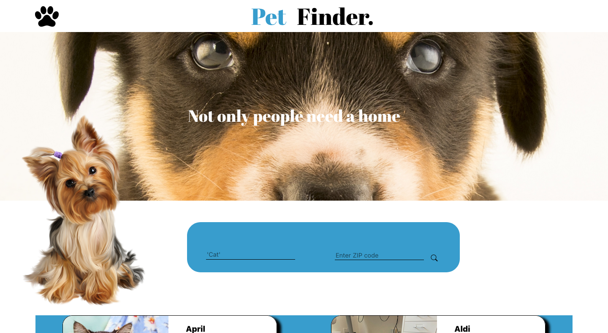

# Pet Finder

### Functionality
1. Outputs first page results (20) of pets.

## Project Info
This project was created to showcase the usageof the following tools. 

- React
- Javascript
- Node.js
- Html
- Css 
- API

The website consist of two search parametes: Animal and Zipcode. 
This outputs 20 individual animals. This project uses React js for the front end and uses Node js for the backend. 

Node js was used to fetch the token given the APi key and Secret

## Front Display

## Full Display

# Getting Started with Create React App

This project was bootstrapped with [Create React App](https://github.com/facebook/create-react-app).

## Available Scripts

In the project directory, you can run:

### `npm start`

Runs the app in the development mode.\
Open [http://localhost:3000](http://localhost:3000) to view it in your browser.

The page will reload when you make changes.\
You may also see any lint errors in the console.

